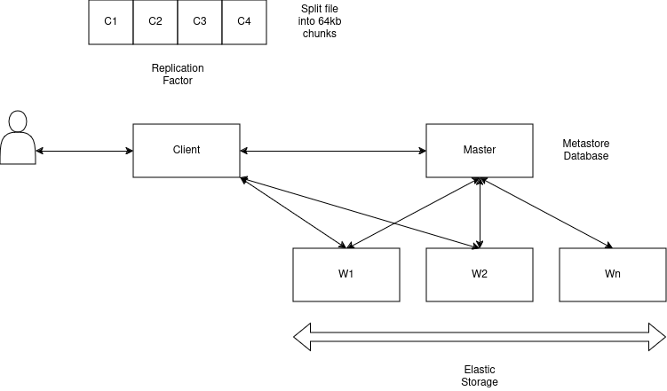

# RDFS

🔧 Rust Distributed File System (RDFS) a toy implementation of Google File System (GFS)


```console

██████  ██████  ███████ ███████
██   ██ ██   ██ ██      ██
██████  ██   ██ █████   ███████
██   ██ ██   ██ ██           ██
██   ██ ██████  ██      ███████

 a toy distributed file system
```

## Intro

Reading the original paper ["The Google File System"](https://pdos.csail.mit.edu/6.824/papers/gfs.pdf)
was the inspiration for HDFS _(Hadoop Distributed File System)_ that later gave way to Amazon's "S3" which has
become almost "defacto" standard. Distributed file systems are super interesting and this project is
an attempt to understand how distributed file systems work by building a toy version of the original GFS.



I really like that idea of creating a single "polymorphic binary" that can act as the following:

- Master node
- Worker node
- Client CLI

## Environment Variables

This binary assumes that the following environemnt variables are present in order to setup the
required global configuration:

| Name          | Example value                        | Description                                |
| ------------- | ------------------------------------ | ------------------------------------------ |
| RDFS_ENDPOINT | https://master-node-ip:8888          | where the master node can be reached       |
| RDFS_TOKEN    | 7687a5ac-ed5a-4d69-8cc3-f78c119b3219 | the security token needed for this cluster |
